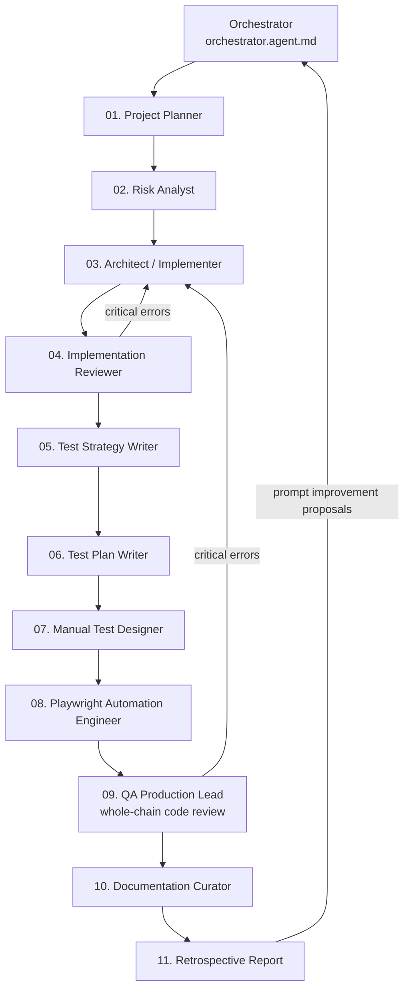

# AI Agent Orchestration - how it works

This document describes the complete AI agent orchestration system built in this repository. The exercise project is a **Todo List** application in Next.js + TypeScript + Tailwind that stores data exclusively in the browser's `localStorage` (no external database). The application itself is only the "training ground"; the real educational value is the process by which 11 specialized agents work together to plan, implement, test, and improve any feature.

## 1. Why this design - principles

1. **One role = one agent.** Each `.agent.md` file has exactly one responsibility (the Single Responsibility Principle applied to agents). This makes `description` values precise and tells the orchestrator whom to call.
2. **Minimal tool set.** A risk-analysis agent does not need `execute` (the terminal), while an implementation agent does. Limiting tools reduces the risk of agent errors and drift.
3. **Shared memory = file system, not conversation context.** Subagents are **stateless**: they receive one task and return one response. Therefore each agent **reads previous artifacts from `docs/**`** and **writes its own artifact** to the appropriate directory. This is the pipeline handoff mechanism.
4. **Each stage has a reviewer.** As required, after planning, risk analysis, and implementation, an agent verifies the previous work before the process proceeds.
5. **Feedback loop.** The final agent (Retrospective Reporter) does not end the process; it closes the loop by reporting gaps and proposing concrete prompt improvements for the next iteration. This is the essence of orchestration, not merely sequential execution.
6. **Human-in-the-loop.** The orchestrator stops and asks the user before irreversible actions (for example deleting files, deploying, or `git push`) in line with operational safety.

## 2. Pipeline - 11 stages + 1 orchestrator

| # | Agent (file) | Role | Input (reads) | Output (writes) |
|---|---|---|---|---|
| 1 | `01-project-planner.agent.md` | Project planning / backlog | user requirement | `docs/planning/plan-<slug>.md`, TODO list items |
| 2 | `02-risk-analyst.agent.md` | Risk analysis (technical, business, security) | plan | `docs/risk/risk-register-<slug>.md` |
| 3 | `03-solution-architect.agent.md` | Architecture + code implementation | plan + risk | source code, `docs/architecture/adr-<slug>.md` |
| 4 | `04-implementation-reviewer.agent.md` | Review of agents 1-3 | plan, risk, code | `docs/reviews/review-implementation-<slug>.md` |
| 5 | `05-test-strategy-writer.agent.md` | Test strategy (project level) | plan, risk, code | `docs/test-strategy/test-strategy.md` (+ optional `.html`) |
| 6 | `06-test-plan-writer.agent.md` | Test plan (feature level) | test strategy | `docs/test-plans/test-plan-<slug>.md` |
| 7 | `07-manual-test-designer.agent.md` | Manual test cases | test plan | `docs/manual-tests/manual-cases-<slug>.md` |
| 8 | `08-automation-engineer.agent.md` | Playwright automation plan and implementation | test plan, manual cases | `e2e/*.spec.ts`, `docs/automation/automation-plan-<slug>.md` |
| 9 | `09-qa-production-lead.agent.md` | Whole-chain code review (2-8) | all prior artifacts | `docs/reviews/review-final-<slug>.md` |
| 10 | `11-documentation-curator.agent.md` | Consolidated documentation of actual implementation | manifest, code, all artifacts | `docs/reports/implementation-<slug>.md` |
| 11 | `10-retrospective-reporter.agent.md` | Final report + agent improvement proposals | all artifacts | `docs/reports/retrospective-<slug>.md` |
| - | `orchestrator.agent.md` | Directs the entire chain | - | updates TODO list, calls subagents in order |

`<slug>` is a short task/feature identifier, such as `dark-mode` or `todo-priorytety`.

## 3. Test strategy documentation format - recommendation

The recommendation is **Markdown (`docs/test-strategy/test-strategy.md`) as the source of truth**: it is versioned in Git, diffable, editable by AI agents without additional tools, and readable directly on GitHub/GitLab. HTML can be generated automatically from Markdown for stakeholders, while PDF/Word should be produced only on explicit request and never treated as the source.

Rule: **one source of truth (Markdown) + automatic conversion to other formats when needed.**

## 4. How to run orchestration

1. Open the agent chat in VS Code and choose **Orchestrator**, or enter a task and let the default agent suggest handing it off.
2. Provide one sentence describing the requirement, such as *"Add the ability to set reminders for tasks"*.
3. The Orchestrator will create a TODO list reflecting 11 stages, call subagents in sequence via `#tool:agent`, pass the task `<slug>`, decide after reviews 4 and 9 whether to continue or return to an earlier stage, create consolidated implementation documentation, then present the retrospective and ask whether to implement proposed prompt improvements.
4. Every artifact goes to `docs/**`, where the decision history can be reviewed in Git.

## 5. Self-documentation contract

Every task additionally has a `docs/manifests/manifest-<slug>.json` manifest linking the eleven pipeline stages to concrete files. The LLM Orchestrator runs `docs:init` before the first agent and `docs:update` after every stage. An update records status, a short summary, and changed implementation files.

The deterministic `scripts/docs.mjs` script provides `init`, `update`, and `validate` operations. `scripts/verify.mjs` runs `validate` as its first gate. Missing manifests in older checkouts do not yet block linting and tests, but every repository with a manifest must pass full validation.

## 6. Agent safety and hygiene rules

- Agents **do not delete** or overwrite predecessors' artifacts; new versions use a date/iteration suffix (`-v2`, `-2026-09-23`), while old versions remain as decision history. Git provides additional versioning.
- The implementation agent (03) and automation agent (08) are the only agents with `execute` (terminal) access; the others only read/write documents.
- The Orchestrator asks for confirmation before irreversible actions such as `git push` or deleting files.
