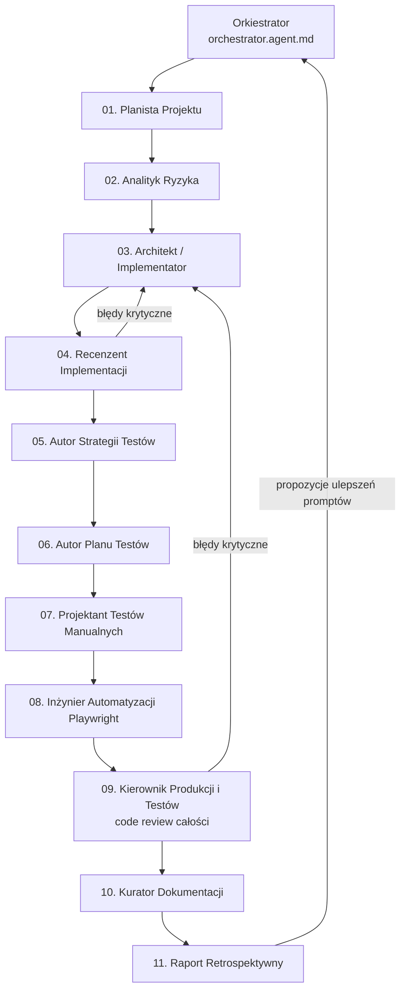

# Orkiestracja Agentów AI — jak to działa

Ten dokument opisuje kompletny system orkiestracji agentów AI zbudowany w tym repozytorium.
Projektem ćwiczeniowym jest aplikacja **Lista zadań (Todo List)** w Next.js + TypeScript + Tailwind,
która przechowuje dane wyłącznie w `localStorage` przeglądarki (brak zewnętrznej bazy danych).
Sama aplikacja jest tylko "poligonem" — prawdziwą wartością edukacyjną jest **proces**, w jaki
11 wyspecjalizowanych agentów współpracuje ze sobą, aby zaplanować, zaimplementować,
przetestować i ulepszyć dowolną funkcjonalność.

## 1. Dlaczego tak, a nie inaczej — zasady projektowe

1. **Jedna rola = jeden agent.** Każdy plik `.agent.md` ma dokładnie jedną odpowiedzialność
   (Single Responsibility Principle przeniesiony na agentów). Dzięki temu opisy (`description`)
   są precyzyjne, a orkiestrator wie, kogo wywołać.
2. **Minimalny zestaw narzędzi.** Agent analizujący ryzyko nie potrzebuje `execute` (terminala),
   agent implementujący go potrzebuje. Ograniczenie narzędzi zmniejsza ryzyko błędów i "dryfu" agenta.
3. **Pamięć współdzielona = system plików, nie kontekst rozmowy.** Subagenci są **bezstanowi**
   — dostają jedno zadanie i zwracają jedną odpowiedź. Dlatego każdy agent **czyta artefakty
   poprzedników z `docs/**`** i **zapisuje własny artefakt** w odpowiednim katalogu. To jest
   mechanizm "handoff" (przekazania) między etapami pipeline'u.
4. **Każdy etap ma swojego "recenzenta".** Zgodnie z wymaganiem — po planowaniu, analizie ryzyka
   i implementacji następuje agent, który **weryfikuje pracę poprzedników** zanim proces pójdzie dalej.
5. **Pętla sprzężenia zwrotnego (feedback loop).** Ostatni agent (Retrospektywa) nie kończy procesu —
   on go **zamyka w pętlę**: raportuje braki i proponuje konkretne poprawki do promptów innych
   agentów, żeby kolejna iteracja była lepsza. To jest esencja "orkiestracji", a nie tylko
   sekwencyjnego wykonania kroków.
6. **Human-in-the-loop.** Orkiestrator zatrzymuje się i pyta użytkownika przed krokami
   nieodwracalnymi (np. usunięcie plików, wdrożenie, `git push`) — zgodnie z zasadą bezpieczeństwa operacyjnego.

## 2. Pipeline — 11 etapów + 1 orkiestrator

| # | Agent (plik) | Rola | Wejście (czyta) | Wyjście (zapisuje) |
|---|---|---|---|---|
| 1 | `01-project-planner.agent.md` | Planowanie projektu / backlog | wymaganie użytkownika | `docs/planning/plan-<slug>.md`, zadania w liście TODO |
| 2 | `02-risk-analyst.agent.md` | Analiza ryzyka (techniczne, biznesowe, bezpieczeństwo) | plan | `docs/risk/risk-register-<slug>.md` |
| 3 | `03-solution-architect.agent.md` | Architektura + implementacja kodu | plan + ryzyko | kod źródłowy, `docs/architecture/adr-<slug>.md` |
| 4 | `04-implementation-reviewer.agent.md` | Weryfikacja pracy agentów 1–3 | plan, ryzyko, kod | `docs/reviews/review-implementation-<slug>.md` |
| 5 | `05-test-strategy-writer.agent.md` | Strategia testowania (poziom projektu) | plan, ryzyko, kod | `docs/test-strategy/test-strategy.md` (+ opcjonalnie `.html`) |
| 6 | `06-test-plan-writer.agent.md` | Plan testów (poziom funkcjonalności) | strategia testów | `docs/test-plans/test-plan-<slug>.md` |
| 7 | `07-manual-test-designer.agent.md` | Przypadki testów manualnych | plan testów | `docs/manual-tests/manual-cases-<slug>.md` |
| 8 | `08-automation-engineer.agent.md` | Plan i implementacja automatyzacji Playwright | plan testów, przypadki manualne | `e2e/*.spec.ts`, `docs/automation/automation-plan-<slug>.md` |
| 9 | `09-qa-production-lead.agent.md` | Code review całego łańcucha (2–8) | wszystkie powyższe artefakty | `docs/reviews/review-final-<slug>.md` |
| 10 | `11-documentation-curator.agent.md` | Zbiorcza dokumentacja faktycznej implementacji | manifest, kod, wszystkie artefakty | `docs/reports/implementation-<slug>.md` |
| 11 | `10-retrospective-reporter.agent.md` | Raport końcowy + propozycje ulepszeń agentów | wszystkie artefakty | `docs/reports/retrospective-<slug>.md` |
| — | `orchestrator.agent.md` | Dyryguje całym powyższym łańcuchem | — | aktualizuje listę TODO, woła subagentów po kolei |

`<slug>` to krótki identyfikator zadania/funkcjonalności, np. `dark-mode` albo `todo-priorytety`.

## 3. Format dokumentacji strategii testów — rekomendacja

Użytkownik pytał, jaki format wybrać dla strategii testów (PDF / Word / MD / HTML). Rekomendacja:

- **Markdown (`docs/test-strategy/test-strategy.md`) jako źródło prawdy.**
  - Wersjonowany w Git, diff-owalny, edytowalny przez agentów AI bez dodatkowych narzędzi.
  - Czytelny bezpośrednio na GitHub/GitLab.
- **HTML jako wersja "do udostępnienia"** — generowany automatycznie z Markdown (np. `npx md-to-html`
  albo prostym skryptem pandoc), do wysłania interesariuszom biznesowym, którzy nie używają Git.
- **PDF/Word — tylko na wyraźne żądanie klienta/audytu.** Traktuj je jako pochodną (eksport),
  nigdy jako źródło — edycja binarnych formatów przez agentów jest zawodna i nie diffuje się w Git.

Zasada: **jedno źródło prawdy (Markdown) + automatyczna konwersja na inne formaty w razie potrzeby.**

## 4. Jak uruchomić orkiestrację

1. Otwórz czat agenta w VS Code i wybierz **Orchestrator** z selektora agentów (albo wpisz zadanie,
   a domyślny agent zaproponuje przekazanie do orkiestratora).
2. Podaj jedno zdanie z wymaganiem, np. *"Dodaj możliwość ustawiania przypomnień dla zadań"*.
3. Orkiestrator:
   - utworzy listę TODO odzwierciedlającą 11 etapów,
   - wywoła kolejno subagentów (`#tool:agent`), przekazując `<slug>` zadania,
   - po każdym etapie recenzji (4 i 9) zdecyduje: kontynuować czy zawrócić do poprzedniego etapu,
   - najpierw utworzy zbiorczą dokumentację implementacji, a następnie przedstawi raport retrospektywny i zapyta, czy wdrożyć proponowane ulepszenia
     promptów agentów.
4. Każdy artefakt trafia do `docs/**` — możesz przeglądać historię decyzji w Git.

## 5. Kontrakt samodokumentowania

Od teraz każde zadanie ma dodatkowo manifest `docs/manifests/manifest-<slug>.json`, który łączy
jedenaście etapów pipeline'u z konkretnymi plikami. Orkiestrator LLM wykonuje `docs:init` przed
pierwszym agentem i `docs:update` po każdym etapie. Wpis aktualizacji zawiera status, krótkie
podsumowanie oraz listę zmienionych plików implementacji.

Deterministyczny skrypt `scripts/docs.mjs` udostępnia trzy operacje:

- `init` — tworzy manifest, katalogi i brakujące szablony Markdown;
- `update` — aktualizuje status artefaktu i dopisuje wpis do jego historii;
- `validate` — wykrywa brakujące artefakty, nieprawidłowy slug i nieobsługiwane statusy.

`scripts/verify.mjs` uruchamia `validate` jako pierwszą bramkę. Brak manifestu w starszym
checkoutcie nie blokuje jeszcze lintowania i testów, ale każde repozytorium z manifestem musi
przejść pełną walidację. Dzięki temu skrypt odpowiada za sprawdzalną kompletność, a agenci za
znaczenie i aktualność treści.

## 6. Zasady bezpieczeństwa i higieny pracy agentów

- Agenci **nie usuwają** ani nie nadpisują artefaktów poprzedników — nowe wersje dopisują się
  z przyrostkiem daty/iteracji (`-v2`, `-2026-09-23`), stare zostają jako historia decyzji.
  Wersjonowanie zapewnia dodatkowo Git.
- Agent implementujący (03) i agent automatyzujący (08) jako jedyni mają dostęp do `execute`
  (terminal) — pozostali są tylko do odczytu/zapisu dokumentów.
- Orkiestrator pyta o potwierdzenie przed krokami nieodwracalnymi (np. `git push`, usuwanie plików).
